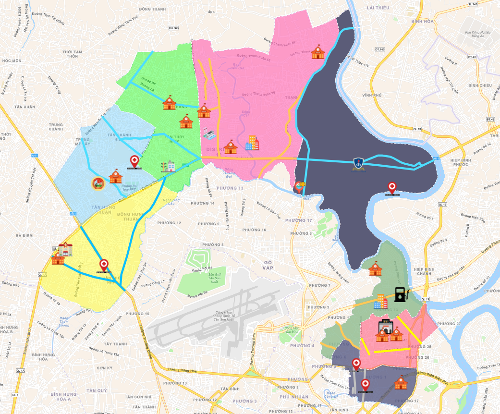
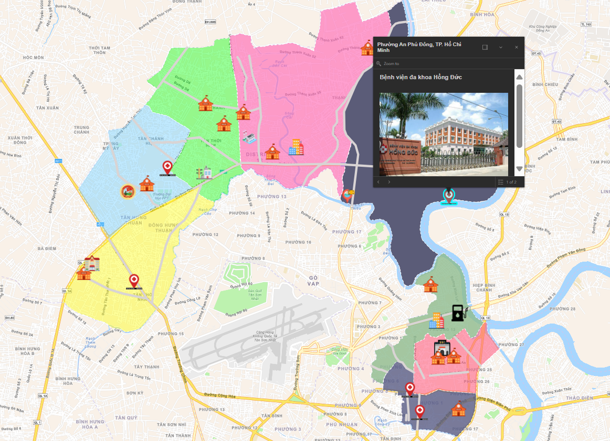

# LAB 1 OF THREE - DIMENSIONAL GEOGRAPHIC INFORMATION SYSTEM

  

## THREE - DIMENSIONAL GEOGRAPHIC INFORMATION SYSTEM
# Table of Contents
- [Introduction to the course](#introduction-to-the-course)
- [Members](#members)
- [Contact](#📫-contact)
# Introduction to the course
- Lecturer: M.Sc. Phan Thanh Vu
- Course name: Three - dimentinal geographic information system
- Course code: IE402
- Class code: IE402.Q11

# Members

| No | ID       | Student's name          | Github                                                       | Email                                                 | Role   |
|----|----------|--------------------------|--------------------------------------------------------------|-------------------------------------------------------|--------|
| 1  | 22520792 | Nguyễn Võ Tiến Lộc       | [Nguyen Vo Tien Loc](https://github.com/iseT1enLoc)          | [22520792@gm.uit.edu.vn](mailto:22520792@gm.uit.edu.vn) | Leader |
| 2  | 22520126 | Trương Hoài Bảo          | [Truong Hoai Bao](https://github.com/hoaibao2k4)             | [22520126@gm.uit.edu.vn](mailto:22520126@gm.uit.edu.vn) | Member |
| 3  | 22520191 | Nguyễn Quang Đăng        | [Nguyen Quang Dang](https://github.com/)                     | [22520191@gm.uit.edu.vn](mailto:22520191@gm.uit.edu.vn) | Member |
| 4  | 22520341 | Phạm Văn Duy             | [Pham Van Duy](https://github.com/duyp6090)                  | [22520341@gm.uit.edu.vn](mailto:22520341@gm.uit.edu.vn) | Member |
| 5  | 22521533 | Nguyễn Công Nam Triều    | [Nguyen Cong Nam Trieu](https://github.com/)                 | [22521533@gm.uit.edu.vn](mailto:22521533@gm.uit.edu.vn) | Member |
| 6  | 22521569 | Trần Quốc Trung          | [Tran Quoc Trung](https://github.com/)                       | [22521569@gm.uit.edu.vn](mailto:22521569@gm.uit.edu.vn) | Member |
| 7  | 22521645 | Võ Thị Phương Uyên       | [Vo Thi Phuong Uyen](https://github.com/)                    | [22521645@gm.uit.edu.vn](mailto:22521645@gm.uit.edu.vn) | Member |
| 8  | 22521631 | Nguyễn Ngọc Thanh Tuyền  | [Nguyen Ngoc Thanh Tuyen](https://github.com/)               | [22521631@gm.uit.edu.vn](mailto:22521631@gm.uit.edu.vn) | Member |
## Project Overview  

This project applies **Geographic Information Systems (GIS)** techniques to analyze and visualize spatial data within the **"New Vietnam Border"** area — focusing on **Bình Thạnh District** and **District 12**.  

The main goal is to explore how GIS tools can be used to understand **urban structures**, **land use**, and **administrative boundaries** in these areas. By integrating spatial layers and boundary data, we aim to provide useful insights for **urban planning**, **infrastructure management**, and **local policy-making**.

### Key Objectives
- Collect and clean spatial data for Bình Thạnh and District 12.  
- Build GIS layers representing administrative borders and local features.  
- Analyze spatial relationships between wards, roads, and infrastructure.  
- Visualize findings through static and interactive maps.

### Project Visualizations  

#### 🌍 Static Overview

#### 🗺️ Interactive Overview

These visualizations represent different aspects of the GIS analysis.  
The **static overview** provides a clear snapshot of the study area, while the **interactive version** enables deeper exploration of ward boundaries and relationships.

---

## Team Task Distribution  

| No. | Former Areas | New Ward | Member |
|:--:|:-------------------------|:-------------|:--------|
| 44 | Tan Thoi Nhat, Tan Hung Thuan, Dong Hung Thuan (District 12) | Dong Hung Thuan Ward | Trung |
| 45 | Trung My Tay, Tan Chanh Hiep (District 12) | Trung My Tay Ward | Duy |
| 46 | Hiep Thanh, Tan Thoi Hiep (District 12) | Tan Thoi Hiep Ward | Loc |
| 47 | Thoi An, Thanh Xuan (District 12) | Thoi An Ward | Tuyen |
| 48 | An Phu Dong, Thanh Loc (District 12) | An Phu Dong Ward | Bao |
| 49 | Ward 1, Ward 2, Ward 7, Ward 17 (Binh Thanh District) | Gia Dinh Ward | Uyen |
| 50 | Ward 12, Ward 14, Ward 26 (Binh Thanh District) | Binh Thanh Ward | Trieu |
| 51 | Ward 5, Ward 11, Ward 13 (Binh Thanh District) | Binh Loi Trung Ward | Dang |

---

## Summary  

This GIS project enhances understanding of **spatial and administrative structures** in selected areas of Ho Chi Minh City.  
By using data-driven geographic visualization, we provide valuable insights that can support **sustainable development** and **smart urban planning**.

## Contact

For issues or feature requests, please open an issue on GitHub or reach out to the maintainer:

- GitHub: [Lab 1-Three - dimentinal geographic information system](https://github.com/iseT1enLoc/IE402LAB1)  
- Email Loc Nguyen: `locnvt.it@gmail.com`